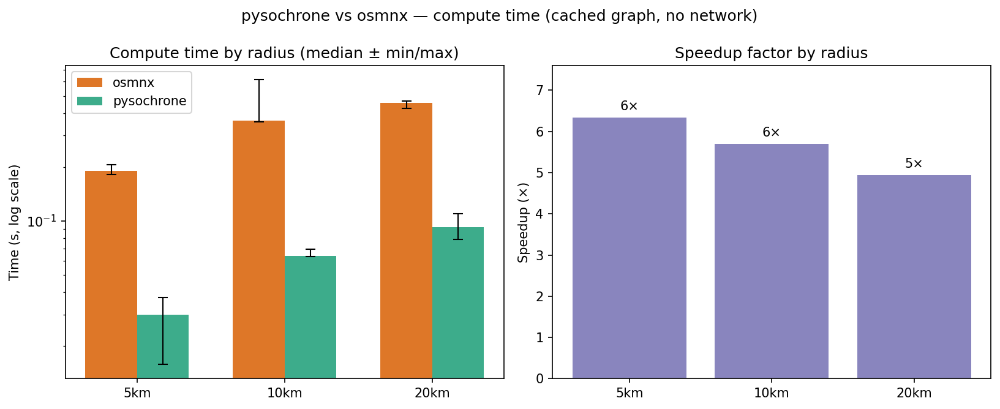

# OSM_graph
*Quickly generate isochrones for Python and Rust!*

This library provides a set of tools for generating isochrones and reverse isochrones from geographic coordinates. It leverages OpenStreetMap data to construct road networks and calculate areas accessible within specified time limits. The library is designed for both Rust and Python, offering high performance and easy integration into data science workflows.


## Features
- **Graph Construction:** Parses OpenStreetMap data to construct a directed graph representing the road network.
- **Graph Simplification:** Topologically simplifies the graph by collapsing linear chains and deduplicating parallel edges, reducing node/edge count by ~89% for faster downstream computation.
- **Spatial Indexing:** R-tree spatial index for O(log n) nearest-node lookups, built once and reused for all queries.
- **Isochrone Calculation:** Generates isochrones using a single Dijkstra traversal, with hull computation parallelized across time limits.
- **Routing:** A* point-to-point routing returning a GeoJSON LineString with distance, total duration, and cumulative travel times at each waypoint.
- **Geocoding:** Place-name to coordinate lookup via Nominatim.
- **Concave and Convex Hulls:** Supports convex, fast-concave, and concave hull types for isochrone shapes.
- **Caching:** Three-level cache (disk XML → in-memory XML → in-memory graph) so repeated queries for the same area skip the network entirely, persisting across process restarts.
- **Python Integration:** Python bindings for all core functionality — isochrones, routing, geocoding, and cache management.
- **GeoJSON Output:** All results returned as GeoJSON strings for easy integration with mapping tools and data science workflows.

## Installation
To use the library in Rust, add it to your Cargo.toml:

```toml
[dependencies]
osm-graph = "0.2.0"
```

For Python:

```bash
pip install pysochrone
```

Or build from source with Rust and maturin installed:

```bash
maturin develop
```

## Usage

### Python

**Isochrones**
```python
import pysochrone

isochrones = pysochrone.calc_isochrones(
    48.137144,                           # lat
    11.575399,                           # lon
    [300, 600, 900, 1200, 1500, 1800],  # time limits in seconds
    "Drive",                             # Drive | DriveService | Walk | Bike | All | AllPrivate
    "Concave",                           # Convex | FastConcave | Concave
    max_dist=10_000,                     # optional bounding box radius in metres
    retain_all=False,                    # False = simplified graph (default)
)
# Returns a list of GeoJSON geometry strings, one per time limit
```

**Routing**
```python
route = pysochrone.calc_route(
    48.137144, 11.575399,   # origin lat, lon
    48.154560, 11.530840,   # destination lat, lon
    "Drive",
)
# Returns a GeoJSON Feature (LineString) with properties:
#   distance_m          – total distance in metres
#   duration_s          – total travel time in seconds
#   cumulative_times_s  – travel time at each waypoint (parallel to coordinates)
```

**Geocoding**
```python
lat, lon = pysochrone.geocode("Marienplatz, Munich, Germany")
```

**Points of interest**
```python
# Pass any isochrone string from calc_isochrones
pois = pysochrone.fetch_pois(isochrones[0])
# Returns a GeoJSON FeatureCollection; each feature carries raw OSM tags as properties
```

**Cache management**
```python
pysochrone.cache_dir()    # path to the on-disk XML cache
pysochrone.clear_cache()  # clear both in-memory and disk caches
```

### Rust

```rust
use osm_graph::isochrone::{calculate_isochrones_from_point, HullType};
use osm_graph::overpass::NetworkType;

#[tokio::main]
async fn main() {
    let (isochrones, _graph) = calculate_isochrones_from_point(
        48.137144,
        11.575399,
        Some(10_000.0),                                        // max_dist in metres; None = auto
        vec![300.0, 600.0, 900.0, 1_200.0, 1_500.0, 1_800.0],
        NetworkType::Drive,
        HullType::Concave,
        false,                                                 // false = simplified (faster)
    )
    .await
    .unwrap();
}
```

## Performance

Benchmarks run on Munich road network, cached data only (no network I/O), Intel Core i7-11370H.
Compared against osmnx using a pre-enriched graph and a single Dijkstra pass — the fairest apples-to-apples comparison.
To reproduce: `python benchmarks/comparison.py`

| Radius  |  Nodes |  Edges | pysochrone |     osmnx | Speedup |
|--------:|-------:|-------:|-----------:|----------:|--------:|
|  5,000m |  6,251 | 15,356 |     0.030s |    0.190s |    6.3× |
| 10,000m | 16,183 | 41,601 |     0.064s |    0.365s |    5.7× |
| 20,000m | 32,501 | 82,385 |     0.092s |    0.455s |    4.9× |

The ~5–6× gap reflects compiled Rust and petgraph's flat adjacency list vs pure-Python NetworkX. osmnx is a full-featured geospatial analysis library rather than a purpose-built isochrone engine — this comparison isolates the core Dijkstra computation to show what you gain from a compiled, cache-aware implementation.

pysochrone's caching model means graph construction and edge enrichment are one-time costs paid on the first query for an area. Subsequent queries reuse the in-memory graph directly, so the numbers above represent steady-state performance for repeated queries over the same region.



## Roadmap
- [ ] Testing and benchmarks.
- [ ] Customizable Speed Limits: Allow users to specify custom speed limits for different road types.
- [x] Support for Pedestrian and Bicycle Networks: Expand the graph construction to support pedestrian and bicycle network types.
- [x] Topological simplification of osm graphs for more efficient downstream analytics.
- [ ] Additional Roadnetwork analytics.
- [x] Routing engine.
- [ ] Advanced Caching Strategies: Implement more sophisticated caching mechanisms for dynamic query parameters.
- [ ] Interactive Visualization Tools: Develop a set of tools for interactive visualization of isochrones in web applications.
- [ ] API Integration: Provide integration options with third-party APIs for enhanced data accuracy and features.
- [ ] Optimization and Parallel Computing: Further optimize the graph algorithms and explore parallel computing options for large-scale data.

## Contributing
Contributions are welcome! Please submit pull requests, open issues for discussion, and suggest new features or improvements.

## License
This library is licensed under MIT License.