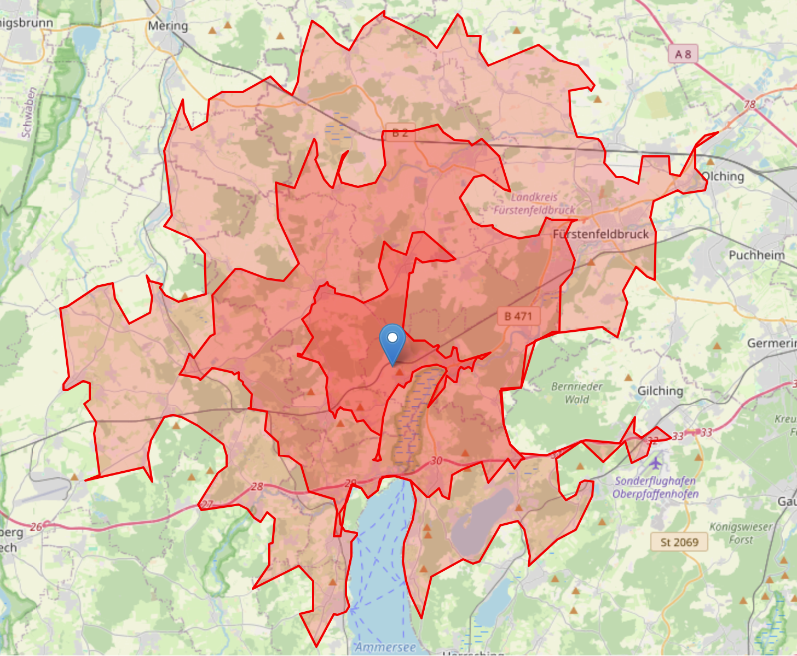

# OSM_graph
*Quickly generate isochrones for Python and Rust!*

This library provides a set of tools for generating isochrones and reverse isochrones from geographic coordinates. It leverages OpenStreetMap data to construct road networks and calculate areas accessible within specified time limits. The library is designed for both Rust and Python, offering high performance and easy integration into data science workflows.



## Features
- Graph Construction: Parses OpenStreetMap data to construct a graph representing the road network.
- Graph Simplification: Topologically simplifies the graph by collapsing linear chains and deduplicating parallel edges, reducing node/edge count by ~89% for faster downstream computation.
- Spatial Indexing: R-tree spatial index for O(log n) nearest-node lookups, built once and reused for all queries.
- Isochrone Calculation: Generates isochrones using a single Dijkstra traversal, with hull computation parallelized across time limits.
- Concave and Convex Hulls: Supports generating both concave and convex hulls around isochrones for more accurate or simplified geographical shapes.
- Caching: Two-level cache (raw OSM XML + built graphs) so repeated queries for the same area require no network calls.
- Python Integration: Offers Python bindings to use the library's functionalities directly in Python scripts, notebooks, and applications.
- Concurrency Support: Utilizes Rust's concurrency features for efficient isochrone calculation over large datasets.
- GeoJSON Output: Converts isochrones into GeoJSON format for easy visualization and integration with mapping tools.

## Installation
To use the library in Rust, add it to your Cargo.toml:

```toml
[dependencies]
osm-graph = "0.1.0"
```

For Python, 

```bash
pip install pysochrone
```

Or, ensure you have Rust and maturin installed, then build and install the Python package:

```bash
maturin develop
```

## Usage
Rust
```rust
use osm_graph::isochrone::{calculate_isochrones_from_point, HullType};
use osm_graph::overpass::NetworkType;

#[tokio::main]
async fn main() {
    let (isochrones, _graph) = calculate_isochrones_from_point(
        48.123456,
        11.123456,
        10_000.0,
        vec![300.0, 600.0, 900.0, 1_200.0, 1_500.0, 1_800.0],
        NetworkType::Drive,
        HullType::Convex,
        false, // false = simplified graph (faster), true = full graph
    )
    .await
    .unwrap();
}
```

Python

```python
import pysochrone

isochrones = pysochrone.calc_isochrones(
    48.123456,   # lat
    11.123456,   # lon
    10_000,      # bounding box radius in meters
    [300, 600, 900, 1200, 1500, 1800],  # time limits in seconds
    "Drive",     # network type: Drive | DriveService | Walk | Bike | All | AllPrivate
    "Concave",   # hull type: Convex | FastConcave | Concave
    False,       # optional: False = simplified (default), True = full graph
)
```

## Roadmap
- [ ] Testing and benchmarks.
- [ ] Customizable Speed Limits: Allow users to specify custom speed limits for different road types.
- [x] Support for Pedestrian and Bicycle Networks: Expand the graph construction to support pedestrian and bicycle network types.
- [x] Topological simplification of osm graphs for more efficient downstream analytics.
- [ ] Additional Roadnetwork analytics.
- [ ] Routing engine.
- [ ] Advanced Caching Strategies: Implement more sophisticated caching mechanisms for dynamic query parameters.
- [ ] Interactive Visualization Tools: Develop a set of tools for interactive visualization of isochrones in web applications.
- [ ] API Integration: Provide integration options with third-party APIs for enhanced data accuracy and features.
- [ ] Optimization and Parallel Computing: Further optimize the graph algorithms and explore parallel computing options for large-scale data.

## Contributing
Contributions are welcome! Please submit pull requests, open issues for discussion, and suggest new features or improvements.

## License
This library is licensed under MIT License.